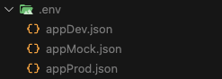

# Bienvenido al coding-interview-frontend

## Descripción

Acá tienes todos los assets que necesitas para llevar a cabo una pequeña prueba técnica. El objetivo es que puedas demostrar tus habilidades de programación y de UI. El proyecto consiste de una pequeña calculadora que te muestra cuanto vas a recibir si quieres cambiar una determinada cantidad de una moneda a otra.

## Características

1. Hay dos tipos de monedas: "FIAT" y "CRYPTO".
2. La tasa de cambio la podrás obtener de nuestro API público.
3. La moneda del input

## API

- URL: https://74j6q7lg6a.execute-api.eu-west-1.amazonaws.com/stage/orderbook/public/recommendations
- Query Params:
  - `type`: 0 -> Cambio de CRYPTO a FIAT, 1 -> Cambio de FIAT a CRYPTO
  - `cryptoCurrencyId`: La moneda crypto (el ID está en el nombre del asset)
  - `fiatCurrencyId`: La moneda fiat (el ID está en el nombre del asset)
  - `amount`: Cantidad a cambiar
  - `amountCurrencyId`: La moneda en la que está del input

Del response, simplemente obtener el `data.byPrice.fiatToCryptoExchangeRate` y multiplicarlo/dividirlo para mostrar toda la data necesaria.

### Que puedes hacer:

- ✅ Preferiblemente, usa Flutter :)
- ✅ Cuantas mejoras de UX como veas necesarias/quieras
- ✅ No todo tiene que estar funcionando a la perfección, lo que más vamos a tomar en cuenta es el parecido con el diseño y la calidad del código.
- ✅ Desarrolla la app con la arquitecura de una app que va a escalar, no hagas un código que no puedas mantener en el futuro.

### Que **no** puedes hacer:

- ❌ Estresarte 🤗

## Pasos para comenzar

1. Haz un fork usando este repositorio como template
2. Clona el repositorio en tu máquina
3. Desarrolla la mini-app
4. Sube tus cambios a tu repositorio
5. Avísanos que has terminado
6. ???
7. PROFIT

### Cualquier duda contactarme a https://www.linkedin.com/in/carlosfontest/

## 🛠 Descripción del trabajo realizado

### 🔧 Arquitectura

Se utilizó **arquitectura limpia** por su gran escalabilidad, especialmente útil en proyectos grandes.

### ⚙️ State Management

Se utilizó **BLoC**, también por su escalabilidad y su buen manejo y separación de la lógica de negocio respecto de la UI.

### 🎨 Design System

Se atomizaron los elementos lo más posible e intentó **reutilizar componentes** para mantener consistencia y orden.

### 🧱 Core

Esta capa se encarga de todo lo que es **cross a la app** (configuraciones, helpers, constantes, etc.).

### 🌐 l10n

Se implementó **internacionalización** para soportar múltiples idiomas.

### 🧪 Env

Se utilizan **tres ambientes**:

- `Mock`: Representa solo el **camino feliz**.
- `Dev`: Igual que producción pero usada para desarrollo.
- `Prod`: Ambiente real de producción.

### 🔌 Inyección de dependencias

Se utiliza la librería **GetIt** como service locator e inyección de dependencias, lo que **facilita la creación de tests**.

---

## 🚀 Cómo ejecutar la app

> **Versión recomendada:** Flutter `3.24` (la misma que usa el Dorado)

### 1. Instalar dependencias

```bash
flutter pub get
flutter gen-l10n
dart run build_runner build --delete-conflicting-outputs
```

### 2. Crear una carpeta en la raiz del proyecto llamada .env con el siguiente contenido:



appMock.json

```json
{
  "ENV": "mock",
  "BASE_URL": "https://74j6q7lg6a.execute-api.eu-west-1.amazonaws.com/"
}
```

appDev.json

```json
{
  "ENV": "development",
  "BASE_URL": "https://74j6q7lg6a.execute-api.eu-west-1.amazonaws.com/"
}
```

appProd.json

```json
{
  "ENV": "production",
  "BASE_URL": "https://74j6q7lg6a.execute-api.eu-west-1.amazonaws.com/"
}
```

### 3. Copiar lo siguiente en el launch.json :

```json
{
  // Use IntelliSense to learn about possible attributes.
  // Hover to view descriptions of existing attributes.
  // For more information, visit: https://go.microsoft.com/fwlink/?linkid=830387
  "version": "0.2.0",
  "configurations": [
    {
      "name": "Launch development",
      "request": "launch",
      "type": "dart",
      "program": "lib/main_development.dart",
      "args": [
        "--flavor",
        "development",
        "--target",
        "lib/main_development.dart",
        "--dart-define-from-file=.env/appDev.json"
      ]
    },
    {
      "name": "Launch mock",
      "request": "launch",
      "type": "dart",
      "program": "lib/main_mock.dart",
      "args": [
        "--flavor",
        "mock",
        "--target",
        "lib/main_mock.dart",
        "--dart-define-from-file=.env/appMock.json"
      ]
    },
    {
      "name": "Launch production",
      "request": "launch",
      "type": "dart",
      "program": "lib/main_production.dart",
      "args": [
        "--flavor",
        "production",
        "--target",
        "lib/main_production.dart",
        "--dart-define-from-file=.env/appProd.json"
      ]
    }
  ]
}
```

### 4. Elegi el ambiente y dale play.
